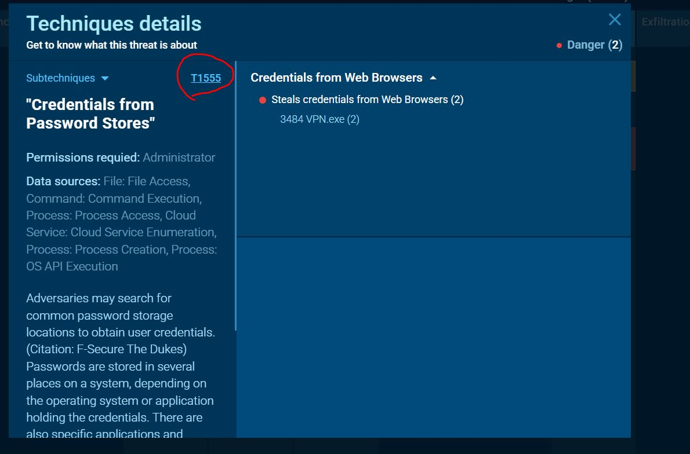

# Lab Writeup - Cyberdefense
## 1. Introduction 
- **Lab Name** : Oski 
- **Category** : Thread Intel
- **Scenario** : The accountant at the company received an email titled "Urgent New Order" from a client late in the afternoon. When he attempted to access the attached invoice, he discovered it contained false order information. Subsequently, the SIEM solution generated an alert regarding downloading a potentially malicious file. Upon initial investigation, it was found that the PPT file might be responsible for this download. Could you please conduct a detailed examination of this file?
- **Objectives** : 
    - Analyze the suspicious PowerPoint (PPT) file to identify any embedded malicious content or payload.
    - Determine the behavior of the file and any connections it attempts to make.
    - Identify Indicators of Compromise (IOCs) related to the attack.
    - Assess the potential impact on the organization.
- **Tools Used**:
    - Virustotal
    - Any Run

## 2. Question and Answers 

### Question 1 : Determining the creation time of the malware can provide insights into its origin. What was the time of malware creation?

**Answer:**

After analyzing the suspicious file using VirusTotal, I found the following information:

The malware was created on: **2022-09-28 17:40**

### Question 2 : Identifying the command and control (C2) server that the malware communicates with can help trace back to the attacker. Which C2 server does the malware in the PPT file communicate with?

**Answer:**

.JPG)

The URL **http://171.22.28.221/9e226a84ec50246d/sqlite3.dll** is used to download a legitimate DLL that facilitates the collection of sensitive data from the host machine. Therefore, the actual exfiltration endpoint—used to send the stolen data back to the attacker's server—is likely **http://171.22.28.221/5c06c05b7b34e8e6.php** 

Command and Control (C2) Server : **http://171.22.28.221/5c06c05b7b34e8e6.php**

### Question 3 : Identifying the initial actions of the malware post-infection can provide insights into its primary objectives. What is the first library that the malware requests post-infection?

**Answer:**

first library that the malware requests post-infection : **SQLite3.dll**

### Question 4 : Upon examining the malware, it appears to utilize the RC4 key for decrypting a base64 string. What specific RC4 key does this malware use?

**Answer:**

After analyzing the malware, it seems that it uses an RC4 key to decode a base64-encoded string. Identifying the exact RC4 key proved somewhat difficult using only open-source intelligence (OSINT). However, with some additional digging, I came across an Any.Run report that included a section detailing the malware's configuration:

> https://app.any.run/tasks/d55e2294-5377-4a45-b393-f5a8b20f7d44

Among several reports I reviewed, this was the only one where the Malware Config section was accessible. Within that section, key elements were exposed—including the RC4 key used by the malware.

RC4 Key : **5329514621441247975720749009**

### Question 5 : Identifying an adversary's techniques can aid in understanding their methods and devising countermeasures. Which MITRE ATT&CK technique are they employing to steal a user's password?

**Answer:**

For this case, let's take a closer look at the ATT&CK section, which outlines the tactics, techniques, and procedures (TTPs) employed by attackers. This section provides valuable insights when examining files, domains, URLs, and IP addresses.

MITRE ATT&CK technique : **T1555**

### Question 6 : Malware may delete files left behind by the actions of its intrusion activity. Which directory does the malware target for deletion?

**Answer:**

By analyzing the commands executed by the malware, we can uncover additional details about its behavior and objectives. This method provides valuable insights into how the malware operates during execution.

Directory : **C:\ProgramData**

### Question 7 : Understanding the malware's behavior post-data exfiltration can give insights into its evasion techniques. After successfully exfiltrating the user's data, how many seconds does it take for the malware to self-delete?

**Answer:**

By examining the process tree, we can observe that a CMD process is spawned under the malware's main process. This CMD instance waits for 5 seconds before deleting the malware executable along with associated DLL files located in the ProgramData folder.

Seconds : **5**

